# Kafka To JDBC POC

This is a Proof of Concept repository. The POC attempts to ingest data records from a specific kafka topic and insert them into a database staging table. After a certain *time*, we need to call a stored procedure to clean/deduplicate/merge the staging table into the target table. The time aspect is something that is sort of "not figured" out - that is we don't really know when new records are be coming in. Perhaps the topic was "quiet" for about 14 hours straight before it went lit :fire: and new set of streams were produced, say 50,000 records, in just a couple of minutes. And then perhaps it was quiet for about 11 hours before it got pumped with another 58,000.

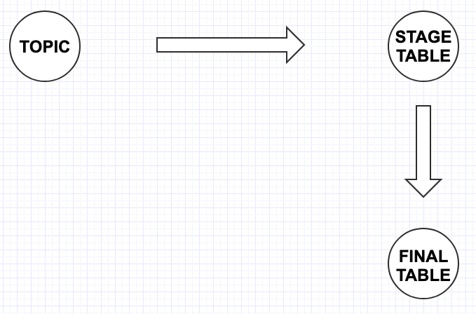

The only thing about this pattern is that it's just "consistent enough". The consistency comes in the fact that once the topic is quiet we have, if not exact, ample amount of time to perform our stored procedure call and get the data all cleaned and merged into the final table. This repository uses an actor model to implement this logic or flow. This very process if very sequential and blocking in nature. The data travels from the topic, lands inside nice and cozy in a staging table, and then its moved over to final table. In other words, the staging table collects *ALL* the data that needs to be moved and then its emptied for the next batch. This results in a very simple flow

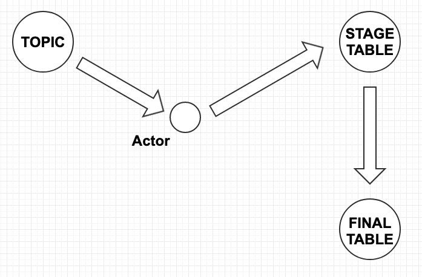

However, the question here is ""**when** do we call the stored procedure?". The amount of data size can fluctuate. Perhaps we need to add another actor to join the consumer group so that multiple partitions can be consumed at the same time. It becomes a bit complex when it comes to finding out the total records processed by the 2 consumers. We need something that kind of maintains the over arching effort here. Yes.. the counts are important but the fact that is more important is that we need to call stored procedure after we have met a certain number. This idea will ensure that the data gets into the final table as fast as it can get there. We need an orchestrator.

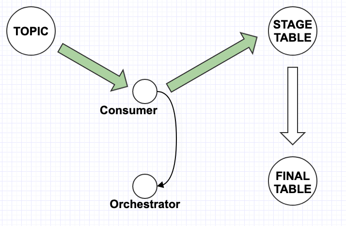 

Here the consumer actor *tells* an asynchronous message count to orchestrator actor every time it finishes the inserting in the staging table. The orchestrator checks if the count was enough. If the message count had not met the criteria, it will update the itself and wait until it receives more counts from the consumer actor. However, if it was infact  enough the orchestrator *tells* the consumer actor to pause. 

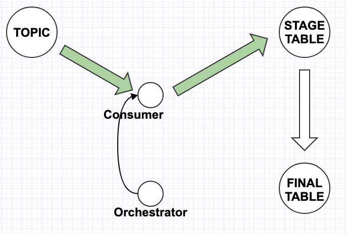

When Consumer actor receives the message from orchestrator it pauses its consumption via `consumer.paused()` API and *tells* the orchestrator that it is paused.

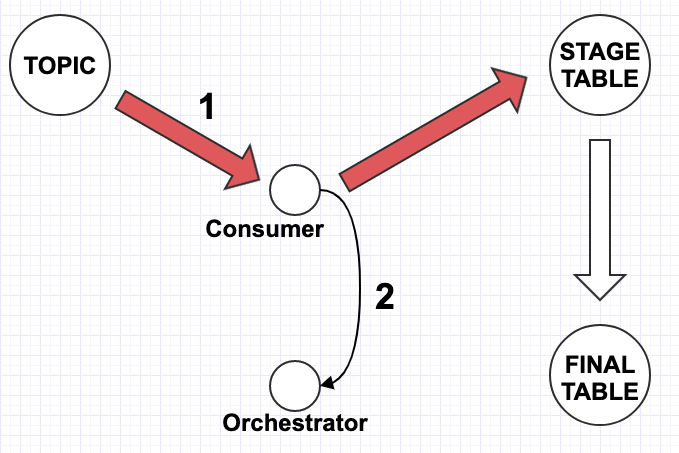

When the orchestrator actor receives the "paused" message from the consumer actor, it *tells* the consumer actor to initiate stored procedure.

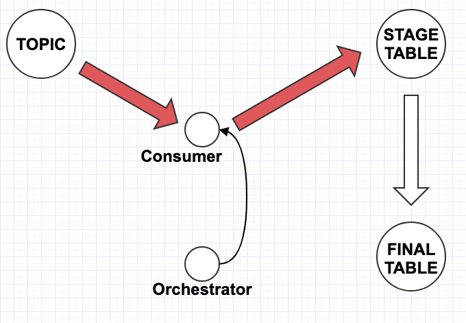

When the consumer actor receives the message, it simply starts the stored procedure call which takes the most amount of time in the whole process.


After completion, consumer actor will *tell* the orchestrator that it finished.


When the orchestrator receives the message, it resets its internal count to 0 and *tells* consumer actor to start back polling records from topic and insert them into staging table.


When the consumer actor receives the message, it opens up the pipeline back on!


## Run the POC

From the root of the projects run the following command from the terminal.

```shell
sbt "project poc" update compile run
```

The above command will do couple things:

1. It will start a kafka, a connect, control center, and postgres in docker.
2. It will autocreate a films table in the Postgres and prepopulate it with one row with my favorite movie :) [The Dark Knight](https://www.imdb.com/title/tt0468569/)
3. Control center should open up automatically on the browser.
4. Once the control center is open, check that the topics tab has a topic called `films` with two partitions. You can confirm that it has 2 partitions if it says "0 to 2" under the column `Under replicated partitions`.
5. It also created a shell script in the target folder called `target/film-generator.sh`. We will use this to generate data on the films topic.

By now your terminal should show this

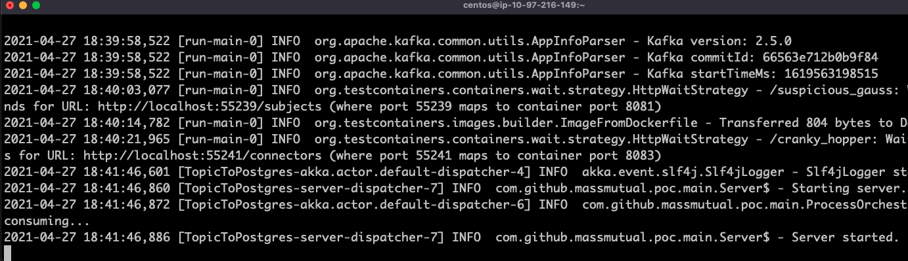

Open up another terminal and go to the root of the project. 

## Add a Consumer Actor

Lets add a consumer actor named `Lucas` 

```shell
curl localhost:8080/consumer/add/lucas
```

It should respond this

```
{
  "consumers":["lucas"]
}
```

## Add another Consumer Actor

If you head over to control center and check the consumer group there is only 1 consumer helping out.

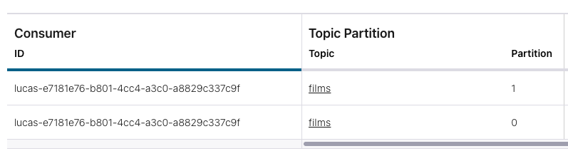

Let's add another consumer, say `Jon`.

```shell
curl localhost:8080/consumer/add/jon
```

```json
{
  "consumers":["lucas","jon"]
}
```

If you check control center again, you will notice now Jon is also helping out!

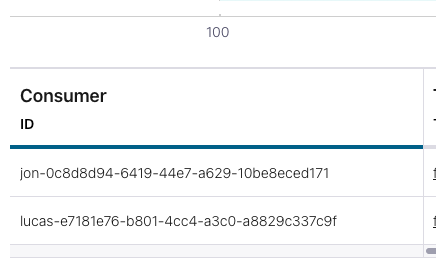

Great! Now we have the consumers ready to ingest `film` topic. We can see both Jon and Lucas are actors and consuming the topic actively.


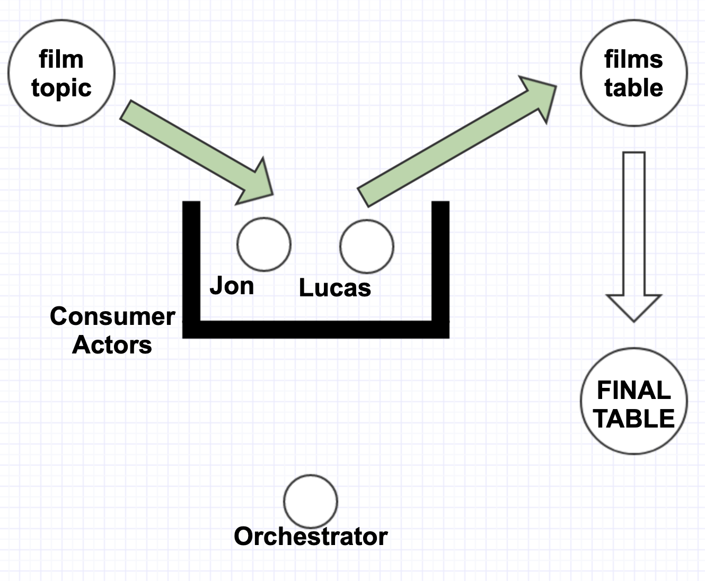

## Data Generation

Let's start the [Datagen connector](https://github.com/confluentinc/kafka-connect-datagen) to start generating messages to into `films` topic. Run this command from the terminal

```shell
sh target/film-generator.sh
```

This will start the data generation. The connector status on the connect tab should indicate it's in RUNNING status.

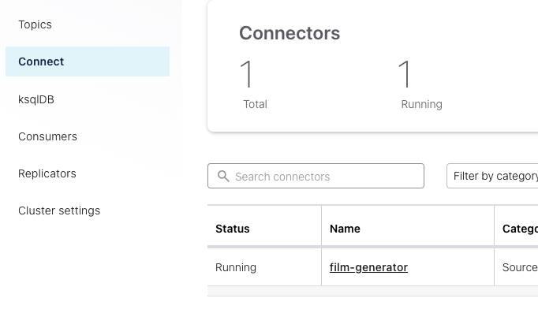

## Check Count Status

Now the data generation is active the consumer actors (Jon and Lucas) can now consume the messages. You can check the count status of the application. Run the following command:

```shell
curl localhost:8080/status
```

The output should resemble something like this:

```json
{
  "currentBatchCount":"68",
  "history":[{
    "batchSize":102,
    "timeTaken":27.132
  },{
    "batchSize":102,
    "timeTaken":26.12
  },{
    "batchSize":104,
    "timeTaken":25.617
  },{
    "batchSize":102,
    "timeTaken":31.023
  },{
    "batchSize":101,
    "timeTaken":27.133
  }]
}
```

It tells us how long it had taken to run data from kafka to the final table. For example currently the application has processed 68 records before the consumer is paused and stored procedure is initiated. The `"history"` contains a list of last 5 finished batches where stored proc was run. For example, the batch size of 102 tool 27 seconds.

You can also check the count in the staging table on Postgres. Run the following command to get inside the postgres docker container.

```shell
docker container exec -it $(docker container ls | grep postgres | awk '{print $1}') bash
```

Run the command

```shell
psql -d test -U test -W
```

This will bring you into psql command interface. Simply run count sql!

```sql
SELECT COUNT(*) FROM films;
 count
-------
  6323
(1 row)
```

Try it couple times. The number should increase consistently.


## Log Inspection

```
2021-04-28 12:32:13,183 [TopicToPostgres-akka.actor.default-dispatcher-14] INFO  com.github.massmutual.poc.main.ProcessOrchestrator$ - total records processed 98
2021-04-28 12:32:13,187 [TopicToPostgres-kafka-sink-dispatcher-12] INFO  com.github.massmutual.poc.main.KafkaToJdbcSink$ - Actor[akka://TopicToPostgres/user/jon#966824769] Inserted 1 records into films
2021-04-28 12:32:13,187 [TopicToPostgres-akka.actor.default-dispatcher-14] INFO  com.github.massmutual.poc.main.ProcessOrchestrator$ - total records processed 99
2021-04-28 12:32:13,688 [TopicToPostgres-kafka-sink-dispatcher-13] INFO  com.github.massmutual.poc.main.KafkaToJdbcSink$ - Actor[akka://TopicToPostgres/user/lucas#-1609888653] Inserted 2 records into films
2021-04-28 12:32:13,688 [TopicToPostgres-akka.actor.default-dispatcher-14] INFO  com.github.massmutual.poc.main.ProcessOrchestrator$ - total records processed 101
2021-04-28 12:32:13,688 [TopicToPostgres-akka.actor.default-dispatcher-14] INFO  com.github.massmutual.poc.main.ProcessOrchestrator$ - processing row count reached (101)! Pausing consumers
2021-04-28 12:32:13,691 [TopicToPostgres-kafka-sink-dispatcher-12] INFO  com.github.massmutual.poc.main.KafkaToJdbcSink$ - Actor[akka://TopicToPostgres/user/jon#966824769] Inserted 1 records into films
2021-04-28 12:32:13,691 [TopicToPostgres-akka.actor.default-dispatcher-14] INFO  com.github.massmutual.poc.main.ProcessOrchestrator$ - total records processed 102
2021-04-28 12:32:13,691 [TopicToPostgres-akka.actor.default-dispatcher-14] INFO  com.github.massmutual.poc.main.ProcessOrchestrator$ - processing row count reached (102)! Pausing consumers
2021-04-28 12:32:14,191 [TopicToPostgres-kafka-sink-dispatcher-13] INFO  com.github.massmutual.poc.main.KafkaToJdbcSink$ - Actor[akka://TopicToPostgres/user/lucas#-1609888653] Inserted 1 records into films
2021-04-28 12:32:14,192 [TopicToPostgres-akka.actor.default-dispatcher-14] INFO  com.github.massmutual.poc.main.ProcessOrchestrator$ - total records processed 103
2021-04-28 12:32:14,192 [TopicToPostgres-akka.actor.default-dispatcher-14] INFO  com.github.massmutual.poc.main.ProcessOrchestrator$ - processing row count reached (103)! Pausing consumers
2021-04-28 12:32:14,195 [TopicToPostgres-kafka-sink-dispatcher-12] INFO  com.github.massmutual.poc.main.KafkaToJdbcSink$ - Actor[akka://TopicToPostgres/user/jon#966824769] Inserted 2 records into films
2021-04-28 12:32:14,195 [TopicToPostgres-akka.actor.default-dispatcher-14] INFO  com.github.massmutual.poc.main.ProcessOrchestrator$ - total records processed 105
2021-04-28 12:32:14,195 [TopicToPostgres-akka.actor.default-dispatcher-14] INFO  com.github.massmutual.poc.main.ProcessOrchestrator$ - processing row count reached (105)! Pausing consumers
2021-04-28 12:32:14,195 [TopicToPostgres-kafka-sink-dispatcher-12] INFO  com.github.massmutual.poc.main.KafkaToJdbcSink$ - Pausing consumer with assigned partition of 0
2021-04-28 12:32:14,195 [TopicToPostgres-kafka-sink-dispatcher-12] INFO  com.github.massmutual.poc.main.KafkaToJdbcSink$ - akka://TopicToPostgres/user/jon Consumer is paused. Not polling more records
2021-04-28 12:32:14,195 [TopicToPostgres-akka.actor.default-dispatcher-14] INFO  com.github.massmutual.poc.main.ProcessOrchestrator$ - consumer paused akka://TopicToPostgres/user/jon
2021-04-28 12:32:14,195 [TopicToPostgres-kafka-sink-dispatcher-12] INFO  com.github.massmutual.poc.main.KafkaToJdbcSink$ - akka://TopicToPostgres/user/jon Consumer is ALREADY paused. Not polling more records
2021-04-28 12:32:14,195 [TopicToPostgres-kafka-sink-dispatcher-12] INFO  com.github.massmutual.poc.main.KafkaToJdbcSink$ - akka://TopicToPostgres/user/jon Consumer is ALREADY paused. Not polling more records
2021-04-28 12:32:14,195 [TopicToPostgres-kafka-sink-dispatcher-12] INFO  com.github.massmutual.poc.main.KafkaToJdbcSink$ - akka://TopicToPostgres/user/jon Consumer is paused. Not polling more records
2021-04-28 12:32:14,195 [TopicToPostgres-kafka-sink-dispatcher-12] INFO  com.github.massmutual.poc.main.KafkaToJdbcSink$ - akka://TopicToPostgres/user/jon Consumer is ALREADY paused. Not polling more records
2021-04-28 12:32:14,698 [TopicToPostgres-kafka-sink-dispatcher-13] INFO  com.github.massmutual.poc.main.KafkaToJdbcSink$ - Actor[akka://TopicToPostgres/user/lucas#-1609888653] Inserted 1 records into films
2021-04-28 12:32:14,699 [TopicToPostgres-akka.actor.default-dispatcher-14] INFO  com.github.massmutual.poc.main.ProcessOrchestrator$ - total records processed 106
2021-04-28 12:32:14,699 [TopicToPostgres-akka.actor.default-dispatcher-14] INFO  com.github.massmutual.poc.main.ProcessOrchestrator$ - processing row count reached (106)! Pausing consumers
2021-04-28 12:32:14,699 [TopicToPostgres-kafka-sink-dispatcher-13] INFO  com.github.massmutual.poc.main.KafkaToJdbcSink$ - Pausing consumer with assigned partition of 1
2021-04-28 12:32:14,700 [TopicToPostgres-kafka-sink-dispatcher-12] INFO  com.github.massmutual.poc.main.KafkaToJdbcSink$ - akka://TopicToPostgres/user/jon Consumer is ALREADY paused. Not polling more records
2021-04-28 12:32:14,700 [TopicToPostgres-kafka-sink-dispatcher-13] INFO  com.github.massmutual.poc.main.KafkaToJdbcSink$ - akka://TopicToPostgres/user/lucas Consumer is ALREADY paused. Not polling more records
2021-04-28 12:32:14,700 [TopicToPostgres-akka.actor.default-dispatcher-14] INFO  com.github.massmutual.poc.main.ProcessOrchestrator$ - consumer paused akka://TopicToPostgres/user/lucas
2021-04-28 12:32:14,700 [TopicToPostgres-kafka-sink-dispatcher-13] INFO  com.github.massmutual.poc.main.KafkaToJdbcSink$ - akka://TopicToPostgres/user/lucas Consumer is paused. Not polling more records
2021-04-28 12:32:14,700 [TopicToPostgres-akka.actor.default-dispatcher-14] INFO  com.github.massmutual.poc.main.ProcessOrchestrator$ - Initiating stored procedure at batch count: 106
```

The above is snapshot of what you would be seeing in the logs. These logs are asynchronous and it can be challenging to udnerstand the behavior and sequence of things happening. First I would like to apologize for making you read the above snippet :sweat_smile: . Please feel free to ignore at sight! However, I would like you to make a simple note. Look at the string 

```scala
2021-04-28 12:32:13,183 [TopicToPostgres-akka.actor.default-dispatcher-14] INFO  com.github.massmutual.poc.main.ProcessOrchestrator$ - total records processed 98
// this log comes from ProcessOrchestrator after either Jon or Lucas processed a batch recently
```

```scala
2021-04-28 12:32:13,187 [TopicToPostgres-kafka-sink-dispatcher-12] INFO  com.github.massmutual.poc.main.KafkaToJdbcSink$ - Actor[akka://TopicToPostgres/user/jon#966824769] Inserted 1 records into films
2021-04-28 12:32:13,187 [TopicToPostgres-akka.actor.default-dispatcher-14] INFO  com.github.massmutual.poc.main.ProcessOrchestrator$ - total records processed 99
                                                                                                                                 
                                                                                                                                 //these two logs indicate jon consumed 1 record and inserted into postgres, and then let ProcessOrchestrator know of this count. Then ProcessOrchestrator updated its internal state from 98 to 99. Here the sequence of these logs is GURANTEED. We can get into the actor/model guarantees later on.
```

Cool. Another thing I would like you to notice is that the log that indicates that all consumers are paused - the very last log.

```scala
2021-04-28 12:32:14,700 [TopicToPostgres-akka.actor.default-dispatcher-14] INFO  com.github.massmutual.poc.main.ProcessOrchestrator$ - Initiating stored procedure at batch count: 106
```

This log represents the count of records that exists inside the staging table before it is merged in using stored procedure. This is the count that will be displayed in the history section when we make the api call `curl localhost:8080/status` - only if it was in the last 5 batches. 

Another thing. `106` record count is not exactly 100. The application setting by default is 100 records as max row count before store procedure is called. The reason it is over 100 is because of the asynchronous nature. The consumer actor, say Jon,  lets the orchestrator know of the count and then it goes back to `poll` another set of records. By the time orchestrator receives the count from Jon it is possible that there were more records on Kafka than just extra 100 and some of them got inserted into the staging table by the time Orchestrator tells the consumers to pause. 

## Lets Have Fun

Lets do some performance improvements on throughtput. Run the status report.

```json
curl localhost:8080/status
{
  "currentBatchCount":"73",
  "history":[{
    "batchSize":108,
    "timeTaken":27.234
  },{
    "batchSize":104,
    "timeTaken":24.239
  },{
    "batchSize":105,
    "timeTaken":29.282
  },{
    "batchSize":105,
    "timeTaken":27.25
  },{
    "batchSize":105,
    "timeTaken":26.224
  }]
}
```

Damn! It is taking 27 seconds to process 108 records? If you check the logs. Jon and Lucas are inserting 1 or 2 rows at a time into the staging table. 

```scala
2021-04-28 12:49:01,052 [TopicToPostgres-kafka-sink-dispatcher-12] INFO  com.github.massmutual.poc.main.KafkaToJdbcSink$ - Actor[akka://TopicToPostgres/user/jon#966824769] Inserted 4 records into films
2021-04-28 12:49:01,555 [TopicToPostgres-kafka-sink-dispatcher-13] INFO  com.github.massmutual.poc.main.KafkaToJdbcSink$ - Actor[akka://TopicToPostgres/user/lucas#-1609888653] Inserted 1 records into films
```

Internally we have set the application to initiate stored procedure when the count hits 100 records. What we want to do here is try to get to 100 a bit more efficiently such that all 100 records get ingested in one poll from each consumer so we see logs like this.

```scala
Inserted 100 records into films
```

This will ensure that each write to the staging table is exactly 100 records per consumer poll. Execute this command

```scala
curl localhost:8080/config/update/max.poll.records=100
{
  "status":"Consumer updated!"
}
```

The above updates Lucas and Jon with an upper bound of 100. If you check the logs you will still see 1 or 2 Insert logs. We also have to update another config that tell Kafka WHEN to respond to each consumer fetch request via `fetch.min.bytes` and `fetch.max.wait.ms` . 

> *`fetch.min.bytes`: This value is one of the fields of Fetch Requests (it's `min_bytes` in http://kafka.apache.org/protocol#The_Messages_Fetch). This value is used by the broker to decide when to send a Fetch Response back to the client. When a broker receives a Fetch Request it can hold it for up to `fetch.max.wait.ms` if there are not `fetch.min.bytes` bytes available for consumption (for example the consumer is at the end of the log or the messages to be consumed add to less than that size)*

Lets set `fetch.min.bytes=2400` and `fetch.max.wait.ms=5000` . The reason is the bytes of data coming into the topic is about 600 bytes per second. We ask the Kafka to wait 5 seconds to give us 2400 bytes of records to 1 `consumer.poll` call. 

```scala
curl localhost:8080/config/update/fetch.min.bytes=2400
curl localhost:8080/config/update/fetch.max.wait.ms=5000
```

Okay. Now lets wait about a minute or so so that we can compare the last 5 batches in the status call. This way we can compare how how much of a performance gain we got.

```scala
curl localhost:8080/status
{
  "currentBatchCount":"11",
  "history":[{
    "batchSize":140,
    "timeTaken":32.553
  },{
    "batchSize":146,
    "timeTaken":34.993
  },{
    "batchSize":144,
    "timeTaken":34.99
  },{
    "batchSize":145,
    "timeTaken":34.991
  },{
    "batchSize":142,
    "timeTaken":34.99
  }]
}
```

It seems like in another 10 seconds, it manages to provide the throughput of 144 records. Each stored proc call takes 2 seconds (i hard coded that for now). So it takes about 33 seconds to put ~145 records into the staging table. Can we do better?

Lets wait 10 seconds.

```scala
curl localhost:8080/config/update/fetch.max.wait.ms=10000
```

```scala
curl localhost:8080/status
{
  "currentBatchCount":"68",
  "history":[{
    "batchSize":170,
    "timeTaken":42.5
  },{
    "batchSize":170,
    "timeTaken":39.307
  },{
    "batchSize":168,
    "timeTaken":43.373
  },{
    "batchSize":169,
    "timeTaken":44.675
  },{
    "batchSize":169,
    "timeTaken":41.809
  }]
}
```

If you notice insert logs it barely even reaches 20.  The data generation connector is set to emit 1 record every 500 ms. This means if we wanted to consume 100 records  we need to make sure production rate is there as well. With current datagen connector setting, it will take 50 seconds to fill 1000 records on the topic. Therefore, lets tweak `fetch.max.wait.ms` to 50000 ms.

```scala
curl localhost:8080/config/update/fetch.max.wait.ms=50000
```

Still nothing. The insert logs

```scala
Inserted 17 records into films
```

```scala
curl localhost:8080/config/update/fetch.min.bytes=20000
```

After adjusting the `fetch.min.bytes` to 20000 bytes (something really really high) enforces jon and lucas to wai a bit and that's why you will see `No records in topic films` logs more often even when the data generation is happening. But when they do get records from Kafka we can see the first poll yielding exactly 100 messages!

```scala
2021-04-28 15:20:20,072 [TopicToPostgres-kafka-sink-dispatcher-12] INFO  com.github.massmutual.poc.main.KafkaToJdbcSink$ - Actor[akka://TopicToPostgres/user/lucas#-1609888653] Inserted 100 records into films
```

```scala
2021-04-28 15:20:18,913 [TopicToPostgres-kafka-sink-dispatcher-13] INFO  com.github.massmutual.poc.main.KafkaToJdbcSink$ - Actor[akka://TopicToPostgres/user/jon#966824769] Inserted 100 records into films
```

We have optimized the insert! Now the status looks something like this:

```scala
curl localhost:8080/status
{
  "currentBatchCount":"0",
  "history":[{
    "batchSize":280,
    "timeTaken":70.032
  },{
    "batchSize":280,
    "timeTaken":66.401
  },{
    "batchSize":280,
    "timeTaken":68.943
  },{
    "batchSize":279,
    "timeTaken":67.397
  },{
    "batchSize":278,
    "timeTaken":71.11
  }]
}
```

Let's introduce a time period where the data generation happens a lot faster. Lets see how the application keeps up with it. Stop the connector from control center and then edit the `target/film-generator.sh` script to generate every 10 ms instead of 500 ms.

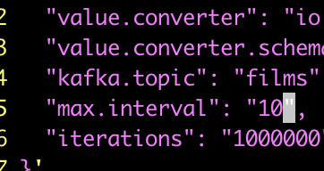

Then start the connector again

```
sh target/film-generator.sh
```

Check the status

```scala
curl localhost:8080/status
{
  "currentBatchCount":"346",
  "history":[{
    "batchSize":447,
    "timeTaken":2.041
  },{
    "batchSize":540,
    "timeTaken":2.04
  },{
    "batchSize":570,
    "timeTaken":3.549
  },{
    "batchSize":539,
    "timeTaken":3.408
  },{
    "batchSize":382,
    "timeTaken":2.051
  }]
}
```

Woah! If you notice the logs are now performing writes to the database with a lot higher number. Increasing the production rate also increases the throughput on th consumer! We can see with `fetch.min.bytes=20000`, `fetch.max.wait.ms=50000` and `max.poll.records=100` the consumer is always active! 

We can conclude that the production rate and consumption rate is matched as we can see that the batches are taking exactly 2 seconds which is basically the stored procedure time.

## Conclusion and Learnings

* We can build a batch based consumer system that sinks data into JDBC and performs separate stored procedure actions using asynchronous actors. We learned how to communicate within actors and establish a pause-resume routine within traditional kafka consumption.
* We learned how to utilize `max.poll.records`, `fetch.max.wait.ms`, and `fetch.min.bytes` to get desired throughput based on production rate.
* One caveat is that this approach will not be suitable for use cases that adhere precise count based operations. Or at least not with this implementation.
* We have an actor for Lucas and Jon. We also have a separate actor that exposes a server on port 8080 - through which we were able to communicate with our application and check its status and update consumer settings without bringing the application down.
* Overall design

